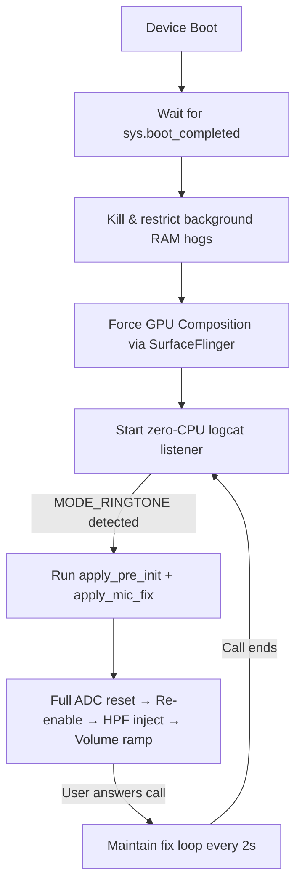

<div align="center">


<br/>


<br/><br/>

> **Advanced, hardware-level audio routing module for Android.**  
> Eliminates call audio delays and mic "no sound" race conditions at the hardware layer.

</div>

---

## 📖 Table of Contents

- [Overview](#-overview)
- [Features](#-features)
- [Installation](#-installation)
- [Terminal CLI](#-terminal-cli)
- [How It Works](#-how-it-works)
- [Changelog](#-changelog)
- [Author](#-author)

---

## 🧠 Overview

**MicFix** is a Magisk / KernelSU module that eliminates the *"no sound on call"* bug at the hardware layer. Instead of relying on Android's audio stack to initialize correctly (which it often fails to do under tight timing), MicFix directly controls the ALSA/SoC mixer controls via `tinymix` to force a full, clean re-initialization of the handset microphone and earpiece routing.

---

## ✨ Features

### 🎯 Zero CPU Usage — Event-Driven Architecture
Instead of polling the audio state every few seconds, MicFix uses a **native `logcat` blocking listener**. It stays completely idle at zero CPU cost and fires instantly the moment the audio subsystem changes state.

### ⚡ Pre-Answer Hardware Initialization
The moment your phone **starts ringing**, MicFix rebuilds the **entire audio route** — ADC, DEC, IIR, mixer switches — so by the time you tap "Answer", the hardware is already calibrated. No delay, clean audio from the first word.

### 🔬 Deep Hardware Routing
```
TX Chain:  ADC0/ADC2 → SWR_MIC → DEC0/DEC1 → TX_AIF1_CAP → Audio DSP
RX Chain:  AIF1_PB → RX_MACRO → RX INT0/INT1 → Earpiece / Speaker
IIR:       DEC0 → IIR0 INP0 (Echo Canceller calibrated pre-call)
HPF:       MSM_SWR_MIC on DEC0/DEC1 (eliminates ADC power-on pop)
```
- Aggressive ADC reset before re-enabling to clear stuck DSP states.
- High-Pass Filter injection to eliminate low-frequency hardware pop on mic power-on.
- Hard isolation of Speaker (`RX_MACRO`) and Mic (`TX_DEC`) paths to guarantee zero cross-talk.
- Volume zeroed then ramped to `84` to prevent transient clipping.

### 🧹 Boot RAM Governor
Restricts heavy background apps from auto-launching at boot. They only consume RAM when **you** open them.

| App | Package |
|---|---|
| WhatsApp | `com.whatsapp` |
| WhatsApp Business | `com.whatsapp.w4b` |
| Facebook | `com.facebook.katana` |
| Facebook Messenger | `com.facebook.orca` |
| Facebook Services | `com.facebook.system`, `com.facebook.appmanager`, `com.facebook.services` |
| Instagram | `com.instagram.android` |
| Google App | `com.google.android.googlequicksearchbox` |
| Snapchat | `com.snapchat.android` |
| TikTok | `com.zhiliaoapp.musically` |
| Twitter / X | `com.twitter.android` |
| Amazon Shopping | `com.amazon.mShop.android.shopping` |
| Netflix | `com.netflix.mediaclient` |
| Spotify | `com.spotify.music` |
| LinkedIn | `com.linkedin.android` |
| Pinterest | `com.pinterest` |
| Twitch | `tv.twitch.android.app` |
| Telegram | `org.telegram.messenger` |
| Viber | `com.viber.voip` |

> To restore an app's background permission manually:
> ```bash
> cmd appops set <package.name> RUN_IN_BACKGROUND allow
> ```

### 🎮 GPU Compositor
Injects `SurfaceFlinger` directives and `system.prop` flags to force GPU rendering for the Launcher and Home Screen — resulting in butter-smooth UI transitions.

---

## 📦 Installation

1. Download `MicFix-Module-v1.0.zip` from the **[Releases](https://github.com/kiran-embedded/MicFix-Magisk-Module/releases)** page.
2. Open **Magisk Manager** or **KernelSU Manager**.
3. Tap **Modules** → **Install from Storage**.
4. Select the downloaded ZIP and confirm.
5. **Reboot** your device.

> **⚠️ Requires `tinymix`** — This module depends on the `tinymix` binary to control audio hardware registers.
> If your device does not have it built-in, install it first using:
>
> **[Tinymix Binary Installer — Magisk Module](https://github.com/Dinodva/Tinymix-Binary-Installer-Magisk-Module)**
>
> Flash that module first, reboot, then flash MicFix.

---

## 💻 Terminal CLI

After rebooting, open **Termux** or any root terminal and run:

```bash
su
micfix
```

**Example output:**
```
=====================================
       MicFix v1.0 Status Tool
=====================================

[*] Module Status:
  -> Service is running. Recent logs:
-------------------------------------
[2026-09-19 10:30:00] MicFix v1.0 (Ultimate Robust ZeroCPU Mode) started.
[2026-09-19 10:30:15] Waiting for call events via zero-CPU logcat listener...
[2026-09-19 10:45:03] RINGTONE DETECTED! Rebuilding entire audio route BEFORE answer...
[2026-09-19 10:45:03] Full Hardware Route Primed and Ready!
-------------------------------------

[*] Boot RAM Optimization Status:
  -> com.whatsapp           : RUN_IN_BACKGROUND: ignore
  -> com.facebook.katana    : RUN_IN_BACKGROUND: ignore
  -> com.snapchat.android   : RUN_IN_BACKGROUND: ignore

[*] Current Audio Mode:
  -> Mode: MODE_NORMAL
=====================================
```

---

## ⚙️ How It Works



---

## 📋 Changelog

### v1.0 — Initial Public Release
- Zero-CPU event-driven logcat architecture
- Full hardware route rebuild on ring (before answer)
- Deep ADC/DEC reset and High-Pass Filter injection
- Speaker/Mic path hard isolation
- Boot RAM governor for 18 background app packages
- GPU SurfaceFlinger compositor injection
- Native `micfix` CLI terminal tool

---

## 👨‍💻 Author

<div align="center">

**kiran-embedded**  
Embedded Systems & Android Developer

[](https://github.com/kiran-embedded)

</div>

---

## 🙏 Credits

| Credit | Details |
|---|---|
| **[Dinodva](https://github.com/Dinodva)** | Creator of the [Tinymix Binary Installer](https://github.com/Dinodva/Tinymix-Binary-Installer-Magisk-Module) — the required dependency for this module to interact with the audio hardware |
| **Magisk / KernelSU Teams** | For the module framework that makes this possible |
| **ALSA / TinyALSA Project** | For the `tinymix` tool used to control SoC audio registers |

<div align="center">

</div>
